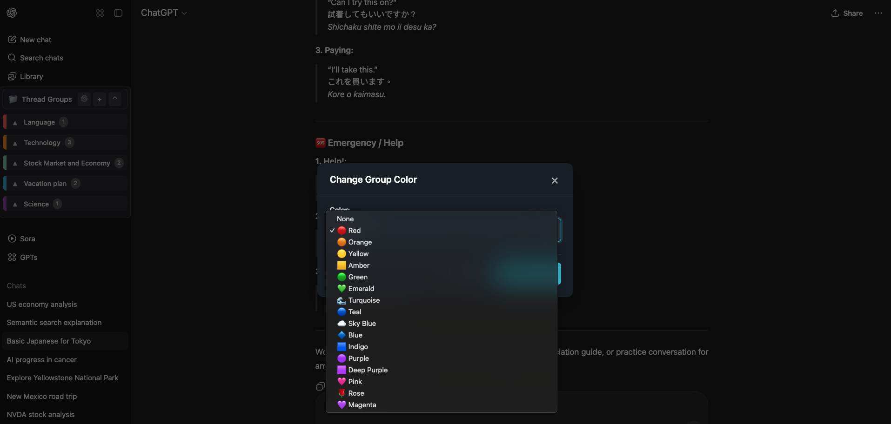
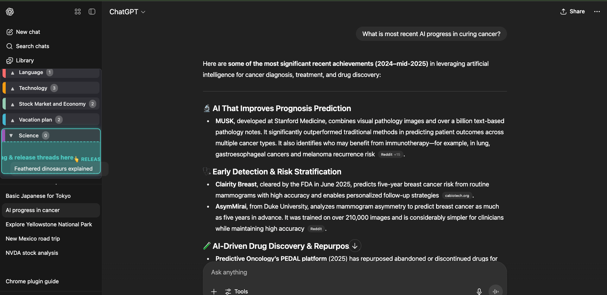
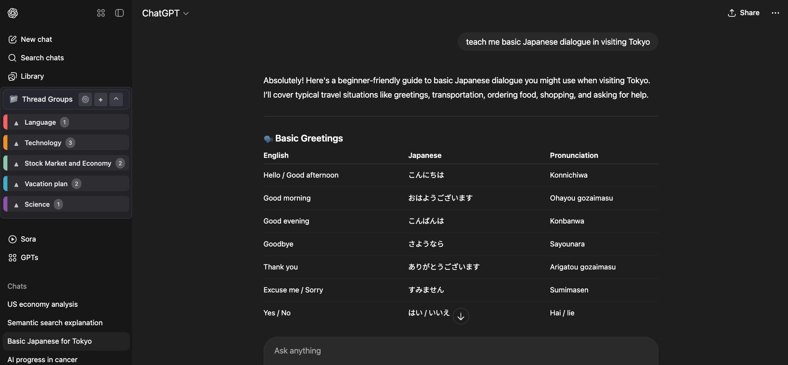
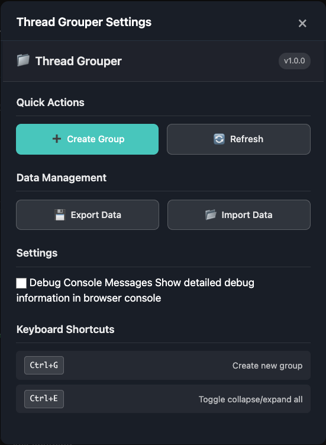

# ChatGPT Thread Grouper

**Organize your ChatGPT conversations into custom groups for better management and navigation.**

Transform your ChatGPT experience with powerful conversation organization tools. Never lose track of important discussions again!

## ✨ Features

### 🎨 **Colorful Group Management**
Create custom groups with personalized colors and names to categorize your conversations by topic, project, or priority.

### 🎯 **Drag and Drop Magic**
Effortlessly organize your conversations with intuitive drag-and-drop functionality. Move threads between groups with a simple mouse gesture.

### 🔄 **Dual Interface Excellence**
Experience the best of both worlds - your organized groups alongside ChatGPT's original interface. Switch between views seamlessly.

### ⚙️ **Settings and Data Management**
Complete control over your data with export/import functionality, customizable settings, and debug options for power users.

## 🚀 Why You'll Love It

**🗂️ Stay Organized**
- Never lose important conversations in an endless scroll
- Group related discussions together for easy access
- Visual color coding for instant recognition

**⚡ Save Time** 
- Find conversations instantly instead of scrolling endlessly
- Quick keyboard shortcuts for power users
- Drag-and-drop organization in seconds

**🔒 Privacy First**
- All data stored locally on your device
- No external servers or data sharing
- Complete control over your conversation organization

**🎨 Customizable**
- Choose your own group colors and names
- Collapsible groups for a clean interface
- Works seamlessly with ChatGPT's existing design

## 📥 Installation

### From Chrome Web Store (Recommended)
1. Visit the Chrome Web Store page [ChatGPT Thread Grouper](https://chromewebstore.google.com/detail/chatgpt-thread-grouper/jlmkhdhaeedobmijpbpgbdfiggcppoeg)
2. Click "Add to Chrome"
3. Confirm the installation
4. Visit [ChatGPT](https://chatgpt.com) and start organizing!

### Manual Installation
1. Download the latest release from Releases (Chrome Web Store (TODO Link TBD))
2. Open Chrome Extensions page (`chrome://extensions/`)
3. Enable "Developer mode"
4. Click "Load unpacked" and select the extension folder

## 🎮 How to Use

1. **Visit ChatGPT**: Navigate to [chatgpt.com](https://chatgpt.com)
2. **Create Groups**: Click the "+" button to create your first conversation group
3. **Organize Conversations**: Drag and drop conversations into your groups
4. **Enjoy**: Experience a cleaner, more organized ChatGPT interface!

### ⌨️ Keyboard Shortcuts
- `Ctrl+G` - Create new group
- `Ctrl+E` - Toggle collapse/expand all groups

## 🛠️ Permissions Explained

The extension requires these permissions to function:

- **Storage**: Save your groups and organization preferences locally
- **ActiveTab**: Access ChatGPT pages to add organization features
- **Host Permissions**: Only works on ChatGPT.com and Chat.OpenAI.com
- **Notifications**: Show welcome message on first install

## 💾 Data Management

**Export Your Data**: Backup your conversation organization to a JSON file
**Import Data**: Restore your groups from a backup file
**Local Storage**: Everything stays on your device - no cloud sync required

## 🆘 Support & Feedback

Having issues or want to suggest improvements?

- 🐛 **Report Bugs**: [Submit an Issue](https://github.com/jackycleancode/ChatGptThreadGrouper/issues)
- �� **Feature Requests**: [Suggest Features](https://github.com/jackycleancode/ChatGptThreadGrouper/issues)
- 📧 **Direct Contact**: [jackycleancode@gmail.com](jackycleancode@gmail.com)

## 🔗 Links

- Chrome Web Store [ChatGPT Thread Grouper](https://chromewebstore.google.com/detail/chatgpt-thread-grouper/jlmkhdhaeedobmijpbpgbdfiggcppoeg)
- [Privacy Policy](PRIVACY_POLICY.md)
- Release Notes TBD

## ⭐ Love the Extension?

If ChatGPT Thread Grouper helps organize your conversations, please:
- ⭐ Rate it on the Chrome Web Store: [ChatGPT Thread Grouper](https://chromewebstore.google.com/detail/chatgpt-thread-grouper/jlmkhdhaeedobmijpbpgbdfiggcppoeg)
- 🐙 Star this repository on GitHub
- 📢 Share it with friends who use ChatGPT

---

**Made with ❤️ for the ChatGPT community**

*Transform your conversation chaos into organized productivity today!* 
